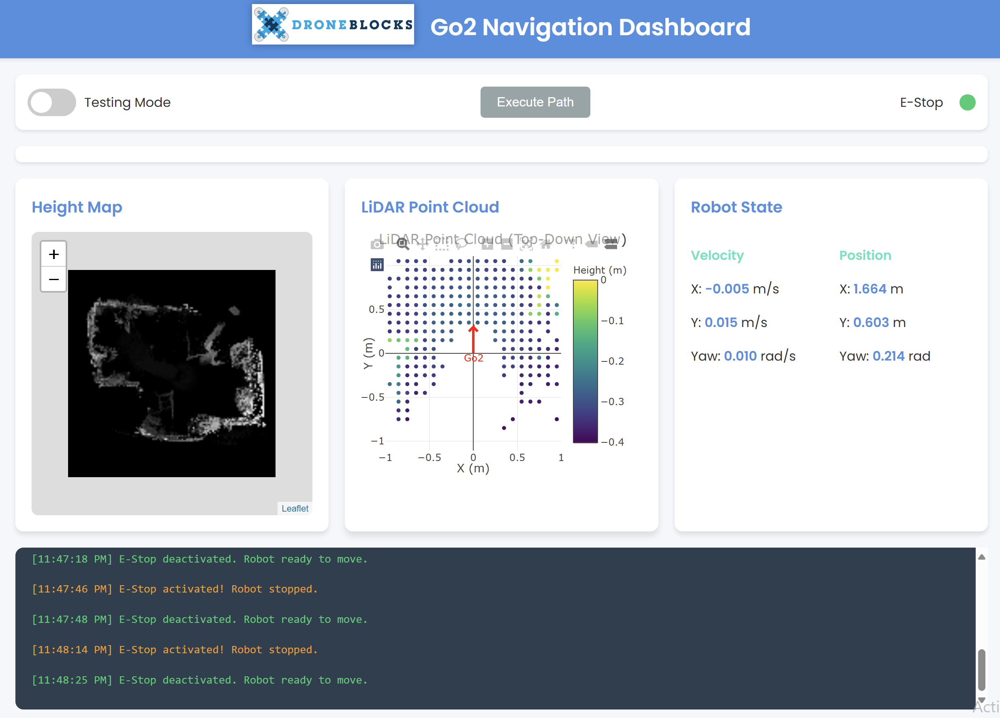

# Go2 Applications: Sensing and Navigation

## Table of Contents
0. [Go2 Setup](#go2-setup)
   - [Connect to the Go2](#connect-to-the-go2)
1. [ROS](#rosbags)
   - [Ensure ROS Installation](#ensure-ros-installation)
   - [Working with ROSbags](#working-with-rosbags)
2. [Sensor Dashboard](#dashboard)
   - [Running the dashboard locally](#running-the-dashboard-locally)
   - [Running the dashboard on Go2](#running-the-dashboard-on-go2)
   - [Dashboard elements](#dashboard-elements)
3. [Example Application: Emergency Stop](#example-application-emergency-stop)
4. [Example Application: Path Planning](#example-application-path-planning)


## Go2 Setup

### Connect to the Go2

Use an ethernet cable to connect your computer to the Go2.

Set up a static IP address for the ethernet connection (https://kb.netgear.com/27476/How-do-I-set-a-static-IP-address-in-Windows) with settings:
- IP address: `192.168.123.99`
- Subnet mask: `255.255.255.0`
- Default gateway: `192.168.123.0`
- DNS Server: `8.8.8.8`

## ROS

### Ensure ROS Installation

With the ethernet cable connected, ssh to the Go2 onboard computer using
```console
PS C:\_\droneblocks_go2_mapping_deployment> ssh unitree@192.168.123.18
```
with the default password `123`.

When you enter you may see a prompt:
```console
ros:foxy(1) noetic(2) ?
```
You should press 1 and then enter. (Foxy is a release of ROS2, Noetic is an older version of ROS.)

Finally, you'll need to run a command to initialize Unitree's ROS library.
```console
unitree@ubuntu:~$ source /home/unitree/unitree_ros2/setup.sh
```

If this `/home/unitree/unitree_ros2/setup.sh` file is missing on your Go2 or you receive an error message from the subsequent ROS commands, contact DroneBlocks.

### Inspect ROS Topics on the Robot


<i>List all ROS topics on the robot:</i>
```console
unitree@ubuntu:~$ ros2 topic list
```

<i>Print info about a topic:</i>
```console
unitree@ubuntu:~$ ros2 topic info /wirelesscontroller
```

<i>Monitor the frequency of a topic:</i>
```console
unitree@ubuntu:~$ ros2 topic hz /wirelesscontroller
```

<i>Print the messages published to a topic:</i>
```console
unitree@ubuntu:~$ ros2 topic echo /wirelesscontroller
```


### Working with ROSbags

<b>What is a ROSBag?</b> A ROSbag is a file that records all of the messages that were published on your robot over some duration of time. If you record one while running your robot, you can use it to play back the robot's experience on a different machine, like your laptop.

Your Unitree Go2's Ubuntu computer comes preinstalled with ROS, specifically ROS2. I'm going to assume you're using a Windows machine to SSH to the robot, and I don't recommend installing ROS on windows since it can be quite a pain. Instead, I've provided a python script `ros2_bagpy.py` that reads rosbags and works cross-platform without requiring a ROS installation.

<i>List the topics in the example rosbag:</i>
```console
PS C:\_\droneblocks_go2_mapping_deployment> python .\ros2_bagpy.py rosbags/rosbag_example.bag list
```

<i>Print the lidar cloud messages in the example rosbag:</i>
```console
PS C:\_\droneblocks_go2_mapping_deployment> python .\ros2_bagpy.py rosbags/rosbag_example.bag echo -t /utlidar/cloud_deskewed -n 10
```


<i>Record a ROSbag on the robot:</i>
```console
PS C:\_\droneblocks_go2_mapping_deployment> ssh unitree@192.168.123.18
unitree@ubuntu:~$ source /home/unitree/unitree_ros2/setup.sh
unitree@ubuntu:~$ ros2 bag record -o 'rosbag_latest.bag' topic /utlidar/cloud_deskewed
```

<i>Download a ROSbag from the robot:</i>
```console
PS C:\_\droneblocks_go2_mapping_deployment> scp -r "unitree@192.168.123.18:/home/unitree/rosbag_latest.bag" "./rosbags"
```

## Dashboard

### Running the dashboard locally
You can run the following python command to start the dashboard:
```console
PS C:\_\droneblocks_go2_mapping_deployment> python dbdash_server.py
```
In the printout, you will see:
```console
 * Running on http://127.0.0.1:9000
 ```
 Then you can go to your favorite web browser, type this into the address bar, and hit enter. The dashboard will load just like a website in your browser window. As it's running on your local machine, it'll show some spoofed data instead of sensor data from your robot.

 

### Running the dashboard on Go2
If it is the first time you're running the dashboard on this dog, you'll need to install the python dependencies on the dog's computer. First, with your dog's ethernet connected, run this command on your local machine to upload the `jetson_packages` folder:
```console
PS C:\_\droneblocks_go2_mapping_deployment> scp -r .\jetson_packages unitree@192.168.123.18:/home/unitree
```


Then, run this command on your local computer to transfer the dashboard files to the dog:
```console
PS C:\_\droneblocks_go2_mapping_deployment> scp -r dbdash_dashboard.html dbdash_server.py unitree@192.168.123.18:/home/unitree
```

Then, you can `ssh` into the dog:
```console
PS C:\_\droneblocks_go2_mapping_deployment> ssh unitree@192.168.123.18
```

And run the script that installs the python packages:
```console
unitree@ubuntu:~$ cd jetson_packages
unitree@ubuntu:~/jetson_packages$ chmod +x install_python_deps_windows_go2part.sh
unitree@ubuntu:~/jetson_packages$ ./install_python_deps_windows_go2part.sh
```

Finally, while `ssh`ed into the dog, run the dashboard:
```console
unitree@ubuntu:~$ python dbdash_server.py
```
Now, open your favorite web browser on your laptop. Type into the address bar: `http://192.168.123.18:9000`. The dashboard will load just like a website in your browser window. And this time, it's running on the dog so you'll see the live sensor data.


## Example Application: Emergency Stop

The `check_estop` function in `dbdash_server.py` implements an emergency stop condition using the lidar data (`self.gridded_points`). If the condition is met, it publishes a `Request` with the stop request code. When the status changes, it emits an update to the web interface.

```python
def check_estop(self):

        # Define the front area of the robot
        front_area = np.array([[-0.2, 0.2], [0.3, 0.5]])  # [x_min, x_max], [y_min, y_max]

        # Filter points in the front area
        mask = (self.gridded_points[:, 0] >= front_area[0, 0]) & (self.gridded_points[:, 0] <= front_area[0, 1]) & \
               (self.gridded_points[:, 1] >= front_area[1, 0]) & (self.gridded_points[:, 1] <= front_area[1, 1])
        front_points = self.gridded_points[mask]

        estop_condition = False

        if len(front_points) > 0:
            # Check if any point is too high (higher than 20cm below the robot)
            if np.any(front_points[:, 2] > -0.2):
                estop_condition = True

                # Stop the robot
                self.velocity_command = Request()
                self.velocity_command.header.identity.api_id = 1003
                self.velocity_publisher.publish(self.velocity_command)


                # Emit a message if transitioning from non-estop to estop state
                if not self.is_estopped:
                    socketio.emit('estop_status', {'is_estopped': True})
                self.is_estopped = True
                return

        # Check if the estop status has just changed
        if estop_condition != self.is_estopped:
            # Commnicate the new state to the web dashboard
            socketio.emit('estop_status', {'is_estopped': estop_condition})
        self.is_estopped = estop_condition
```

## Example Application: Path Planning

The `calculate_path` function in `dbdash_server.py` implements a path planning algorithm to compute a collision-free path from start to goal cells in a 2D heightmap. 

```python
def calculate_path(self, start, goal, heightmap):
        def heuristic(a, b):
            return np.sqrt((b[0] - a[0]) ** 2 + (b[1] - a[1]) ** 2)

        def get_neighbors(pos):
            neighbors = []
            for dx, dy in [(0, 1), (1, 0), (0, -1), (-1, 0), (1, 1), (1, -1), (-1, 1), (-1, -1)]:
                new_pos = (pos[0] + dx, pos[1] + dy)
                if 0 <= new_pos[0] < len(heightmap) and 0 <= new_pos[1] < len(heightmap[0]):
                    neighbors.append(new_pos)
            return neighbors

        frontier = PriorityQueue()
        frontier.put((0, start))
        came_from = {start: None}
        cost_so_far = {start: 0}

        while not frontier.empty():
            current = frontier.get()[1]

            if current == goal:
                break

            for next_pos in get_neighbors(current):
                new_cost = cost_so_far[current] + heightmap[next_pos[0]][next_pos[1]]
                if next_pos not in cost_so_far or new_cost < cost_so_far[next_pos]:
                    cost_so_far[next_pos] = new_cost
                    priority = new_cost + heuristic(goal, next_pos)
                    frontier.put((priority, next_pos))
                    came_from[next_pos] = current

        path = []
        current = goal
        while current != start:
            path.append(current)
            current = came_from[current]
        path.append(start)
        path.reverse()

        return path
```

To connect the path planning function to the dashboard and sensor data, we use a socket callback `handle_plan_path` that calls calculate_path on the data passed from the dashboard:
```python
@socketio.on('plan_path')
def handle_plan_path(data):
    global robot_dog_node
    start = tuple(data['start'])
    end = tuple(data['end'])
    heightmap = np.array(robot_dog_node.test_heightmap)  # Use the test heightmap for now
    path = robot_dog_node.calculate_path(start, end, heightmap)
    print(start, end, path)
    socketio.emit('path_result', json.dumps(path))
```

In `dbdash_dashboard.html`, we listen for the user's click and when a start and goal point have been clicked, we emit the `plan_path` query with the associated points:
```js
function initMap() {
   map = L.map('height-map', {
         crs: L.CRS.Simple,
         minZoom: -2
   });

   map.on('click', function(e) {
         if (isPlanning) {
            logMessage("Path planning in progress. Please wait.", "warning");
            return;
         }

         const y = Math.floor(e.latlng.lat);
         const x = Math.floor(e.latlng.lng);

         if (x >= 0 && x < heightmapData.width && y >= 0 && y < heightmapData.height) {
            if (!startPoint) {
               startPoint = [y, x];  // Store as [y, x]
               startMarker = L.marker([y, x], {icon: L.divIcon({className: 'start-marker', html: 'S'})}).addTo(map);
               statusIndicator.textContent = "Start point selected. Click to set end point.";
               logMessage(`Start point set at (${y}, ${x})`);
            } else if (!endPoint) {
               endPoint = [y, x];  // Store as [y, x]
               endMarker = L.marker([y, x], {icon: L.divIcon({className: 'end-marker', html: 'E'})}).addTo(map);
               statusIndicator.textContent = "End point selected. Planning path...";
               logMessage(`End point set at (${y}, ${x}). Planning path...`);

               isPlanning = true;
               socket.emit('plan_path', { start: startPoint, end: endPoint });
            }
         }
   });
}
```

In return, when `handle_plan_path` emits a `path_result`, this code in `dbdash_dashboard.html` renders it:
```js
socket.on('path_result', function(data) {
   pathData = JSON.parse(data);
   if (pathLayer) {
         map.removeLayer(pathLayer);
   }
   // Assuming pathData is already in [y, x] format
   pathLayer = L.polyline(pathData, {color: 'blue'}).addTo(map);
   isPlanning = false;
   statusIndicator.textContent = "Path planning complete.";
   logMessage(`Path planning complete. Path length: ${pathData.length} points`);
});
```